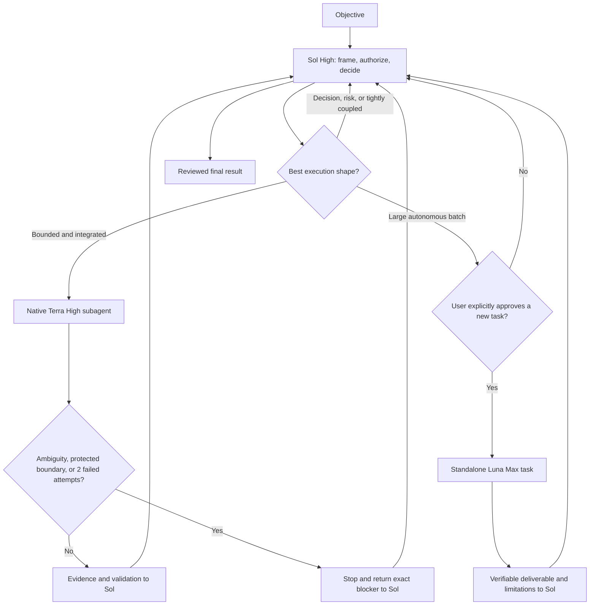

# Codex Sol–Terra Orchestration

A small, native Codex workflow: **Sol High** owns the parent thread and
**Terra High** is the default native subagent for independent, bounded work.
For large autonomous batches, Sol may also propose a separate user-owned
**Luna Max task** after explicit approval. Luna is not forced into the native
subagent protocol. The workflow uses documented `features.multi_agent` and
`[agents]` settings only — no model catalog patch, compatibility override, or
custom agent profile.

> [!IMPORTANT]
> This repository is an installation overlay, never a replacement for a
> personal Codex configuration. Preserve the user's existing settings and any
> model selection made explicitly in the client.

## Operating model

| Role | Model and effort | Responsibility |
|---|---|---|
| Parent orchestrator | `gpt-5.6-sol` / `high` | Frame scope, authorize within the user's bounds, make decisions, review evidence, and conclude. |
| Native subagent | `gpt-5.6-terra` / `high` | Explore or execute independent, bounded work and return a concise, verified result. |
| Optional standalone batch task | `gpt-5.6-luna` / `max` | Process a large, autonomous, repeatable workload after explicit user approval, then return a verifiable deliverable to Sol. |



The choice is based on difficulty, ambiguity, blast radius, reversibility,
security and data risk, objective validation, and ownership — not task size.
One file has one owner in a batch. Terra is a good fit for read-heavy scans,
supporting documents, bounded tests, evidence collection, and implementation
already decided by Sol. It aims for speed and efficiency on that work; this
repository makes no fixed percentage claim about the tokens or time used by an
individual task.

The optional Luna lane is a different execution shape, not another native
subagent default. Use it only when a workload is large enough to justify a
separate task, can run from a self-contained handoff, needs no proactive V2
coordination, and has objective acceptance criteria. Sol must explain the
split and wait for explicit approval before creating the user-owned task. See
[Standalone Luna Max tasks](docs/STANDALONE-LUNA-TASKS.md).

On July 30, 2026, OpenAI [announced a 20% price reduction for Terra](https://openai.com/index/advancing-the-price-performance-frontier-with-gpt-5-6/)
and said the lower price is also reflected in how Terra usage counts against
paid Codex and ChatGPT Work subscriptions. That is a pricing and usage-credit
change, not a promise that every Terra task emits 20% fewer tokens.

The official [Subagents documentation](https://learn.chatgpt.com/docs/agent-configuration/subagents)
describes `gpt-5.6-terra` as a faster, lower-cost choice for lighter subagent
work and recommends parallelism first for read-heavy work. The official
[configuration reference](https://learn.chatgpt.com/docs/config-file/config-reference)
documents the stable multi-agent flag and `[agents]` defaults used here.

## Installation

Give a fresh Codex task this prompt:

```text
Install the workflow documented at:
https://github.com/augiefra/codex-sol-terra-orchestration

Read README.md, SECURITY.md, docs/INSTALL-WITH-CODEX.md,
docs/STANDALONE-LUNA-TASKS.md,
templates/config.fragment.toml, and templates/AGENTS-routing.md before making
any change. Audit my existing Codex configuration first.

Merge, do not replace: preserve all unrelated config.toml and AGENTS.md
settings, including approval, sandbox, authentication, network, MCP, plugin,
connector, project-trust, and model settings that I explicitly selected.

Install the documented native defaults: Sol High for the parent thread and
Terra High for native subagents. Do not create a custom agent, use a model
catalog override, or add internal feature flags.

Install the optional standalone-task routing rule as instructions only: Sol
may propose a separate Luna Max task for a large autonomous batch, but it must
wait for my explicit approval before creating one. Luna must never be presented
as a native Multi-Agent V2 subagent. Do not create a Luna task during
installation.

Before finishing, show the diff; parse changed TOML; run the static verifier;
run one clean, read-only Sol-parent/Terra-child smoke test; verify each
runtime identity from its own exact rollout if available; and report anything
that needs a Codex restart. Do not commit, push, deploy, publish, or change an
external system.
```

The guarded paths are in [docs/INSTALL-WITH-CODEX.md](docs/INSTALL-WITH-CODEX.md)
and [docs/MANUAL-INSTALL.md](docs/MANUAL-INSTALL.md).

## What is merged

1. Keys from [templates/config.fragment.toml](templates/config.fragment.toml)
   into matching `~/.codex/config.toml` tables.
2. The routing section from
   [templates/AGENTS-routing.md](templates/AGENTS-routing.md) into existing
   global `~/.codex/AGENTS.md`.

Nothing copies a whole configuration, model cache, catalog, credential, or
machine-specific setting. The configuration fragment enables multi-agent,
enables native agents, caps concurrent child threads at 10, and pins Terra
High as the default subagent. The optional Luna Max lane lives only in
instructions and does not add a `config.toml` key. An explicit spawn setting
can still take precedence, as documented by OpenAI.

## Runtime truth, not configuration claims

Configuration is intent, not proof. When runtime metadata is available, the
workflow identifies the current process from its exact `CODEX_THREAD_ID`:

```text
CODEX_THREAD_ID -> first session_meta.payload.id of owning rollout
                -> latest turn_context -> actual model + effort
```

The first-event rule matters because a subagent rollout can embed its parent's
`session_meta` later in inherited history.

Use [scripts/inspect_runtime_model.py](scripts/inspect_runtime_model.py) as a
read-only helper. If direct metadata and an exact rollout cannot prove the
identity, the final response says `Model : non exposé par le runtime` instead
of inventing a label.

## Sources and scope

The primary sources are the official [Subagents documentation](https://learn.chatgpt.com/docs/agent-configuration/subagents)
and [configuration reference](https://learn.chatgpt.com/docs/config-file/config-reference).
Eric Provencher's [post on X](https://x.com/pvncher/status/2083300990350954981)
is included only as guidance from a Codex team member, not as a product
contract. See [docs/OFFICIAL-SOURCES.md](docs/OFFICIAL-SOURCES.md) for the
evidence boundary.

## Repository map

```text
.
├── README.md
├── AGENTS.md
├── SECURITY.md
├── docs/
│   ├── ARCHITECTURE.md
│   ├── INSTALL-WITH-CODEX.md
│   ├── MANUAL-INSTALL.md
│   ├── OFFICIAL-SOURCES.md
│   ├── STANDALONE-LUNA-TASKS.md
│   ├── TROUBLESHOOTING.md
│   └── VERIFICATION.md
├── scripts/
│   ├── inspect_runtime_model.py
│   └── verify_install.py
└── templates/
    ├── AGENTS-routing.md
    └── config.fragment.toml
```

## License

[MIT](LICENSE)
