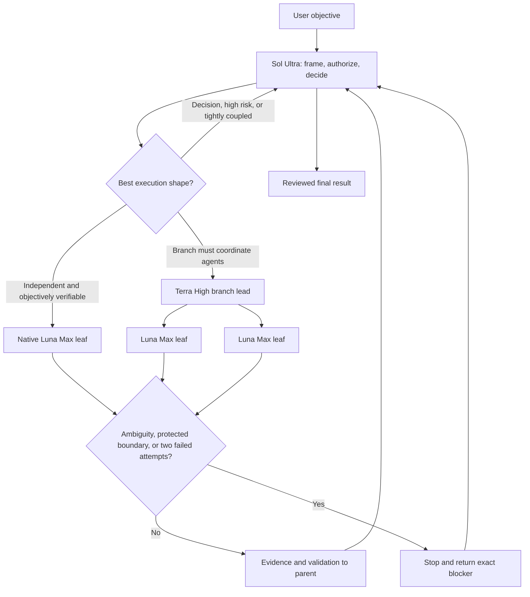

# Codex Sol–Luna–Terra Orchestration

A native, evidence-backed Codex workflow:

- **Sol Ultra** owns the parent thread, authority, architecture, review, and final
  integration.
- **Luna Max** is the default native **leaf subagent** for independent, bounded,
  repeatable, or high-volume work.
- **Terra High** is selected only when a branch must coordinate other agents,
  communicate proactively, delegate recursively, or perform materially deeper
  intermediate reasoning.

The workflow uses documented `features.multi_agent` and `[agents]` settings.
It requires no model-catalog patch, compatibility override, internal V2 flag,
or custom agent profile.

> [!NOTE]
> **Routing profile updated 2026-08-16:** Sol Ultra is now the default parent
> and Luna Max remains the default terminal leaf. Codex coordinators can
> delegate to supported leaf models, including Luna, without making Luna a
> collaborative peer. The dated rollout history is documented in
> [Evolution, evidence, and attribution](docs/EVOLUTION-AND-EVIDENCE.md).

> [!IMPORTANT]
> This repository is an installation overlay, never a replacement for a
> personal Codex configuration. Preserve existing settings and every model or
> reasoning selection explicitly made by the user in the active client. That
> precedence is scoped: a manual parent-thread choice controls the parent, while
> an unpinned child still uses `[agents]` unless the user also selected the
> child's model or explicitly applied the choice to all child work.

## Why this repository changed

The safe answer changed as Codex changed:

- On July 31, 2026,
  [Eric Provencher (@pvncher on X)](https://x.com/pvncher)
  [warned users not to patch their model catalog](https://x.com/pvncher/status/2083300990350954981)
  to force Luna into capabilities that were not natively exposed.
- On August 15, he announced that Multi-Agent V2 coordinators could
  [delegate to any supported model, including Luna](https://x.com/pvncher/status/2088641056237580632).
- He then described
  [two subagent tiers](https://x.com/pvncher/status/2088666195381592153):
  collaborative Sol/Terra agents and terminal Luna/older-model leaves.

Those statements are not contradictory; they describe two points in a product
rollout. The enduring rule is **do not force an internal capability**. The new
native route lets Sol or Terra delegate to Luna without a catalog patch.

This repository turns that distinction into a conservative default, while
keeping official documentation and observed runtime metadata above social
posts in the evidence hierarchy.

## Start here

| If you want to… | Read… |
|---|---|
| Install this on a neutral Codex setup | [Five-minute quickstart](docs/QUICKSTART.md) |
| Understand why Luna is now native but still a leaf | [Evolution, evidence, and attribution](docs/EVOLUTION-AND-EVIDENCE.md) |
| Decide between Sol, Luna, and Terra in real tasks | [Routing recipes](docs/ROUTING-RECIPES.md) |
| Understand authority, context, and escalation | [Architecture](docs/ARCHITECTURE.md) |
| Prove the actual model that ran | [Verification](docs/VERIFICATION.md) |
| Check what is documented, observed, or still client-specific | [Compatibility and proof status](docs/COMPATIBILITY.md) |
| See what changed in the current workflow | [Changelog](CHANGELOG.md) |

## Operating model

| Role | Model and effort | Responsibility |
|---|---|---|
| Parent owner | `gpt-5.6-sol` / `ultra` | Frame scope, preserve authority boundaries, make cross-cutting decisions, proactively delegate suitable work, review evidence, and conclude. |
| Default native leaf | `gpt-5.6-luna` / `max` | Complete one clear, independent assignment and return a concise, verified result. It does not coordinate peers or recursively delegate. |
| Collaborative branch lead | `gpt-5.6-terra` / `high` | Coordinate a bounded subproject when proactive inter-agent communication or recursive delegation is genuinely needed. |
| Optional separate batch task | `gpt-5.6-luna` / `max` | Process an exceptionally large autonomous batch after explicit user approval for a new user-owned task. |



Sol can coordinate several independent Luna leaves directly. Terra is not an
obligatory layer between Sol and Luna; insert Terra only when the branch itself
needs coordination or a stronger intermediate owner.

## What is automatic, and what is configured

Codex supplies the orchestration harness and the capability surface available
to each model. Luna can be used as a native focused subagent, while Sol and
Terra are the appropriate choices for collaborative coordination.

The harness does **not** remove the need to choose a routing default. Codex
resolves an agent's model and effort from an explicit spawn setting, then the
corresponding `[agents]` default, then the parent settings. This repository
therefore pins Luna Max as the ordinary child default and tells the parent to
override explicitly to Terra High for a collaborative branch. A model chosen
manually for the parent remains the parent model; it does not implicitly erase
the separate child-resolution order.

Applicable `AGENTS.md` or skill instructions can request delegation without the
user repeating “use a subagent” in every prompt. This profile deliberately uses
Ultra as the global parent default so Sol can delegate suitable independent work
more proactively. That choice favors orchestration quality and completion over
minimum latency or token use.

Official guidance recommends using the lowest reasoning effort that meets the
quality bar. This opinionated profile nevertheless keeps every routed Luna leaf
at Max: Luna remains the lowest-cost GPT-5.6 family model, and this workflow
prioritizes stronger terminal execution over the marginal saving from lowering
its effort. That is a repository policy, not a universal OpenAI requirement.

## Routing gate

Choose by reasoning difficulty, ambiguity, blast radius, reversibility,
security and data risk, objective validation, and ownership — never by size
alone.

Use Luna Max for:

- read-only repository, document, and log exploration;
- web research and Browser evidence collection;
- bounded console and configuration work;
- targeted tests and deterministic validation;
- mechanical transformations and small implementations already decided by the
  parent;
- high-volume work with a stable scope and objective acceptance criteria.

Use Terra High when the delegated branch must:

- exchange proactive messages with agents;
- steer or reassign work;
- recursively delegate to leaves;
- integrate several dependent intermediate results;
- reason through a materially more complex but still bounded subproject.

Keep work with the parent when it involves architecture, unresolved product
choices, permissions, authentication, security, data integrity, destructive
migration, production changes, or a public/cross-system contract.

One file has one owner in a batch. A child stops on a protected boundary and
after two distinct evidence-based attempts fail.

For concrete Browser, repository, implementation, and collaborative-branch
packets, see [Routing recipes](docs/ROUTING-RECIPES.md).

## Native configuration fragment

Merge these values into the existing tables; never append duplicate TOML
tables and never replace the complete file:

```toml
model = "gpt-5.6-sol"
model_reasoning_effort = "ultra"

[features]
multi_agent = true

[agents]
enabled = true
max_concurrent_threads_per_session = 8
default_subagent_model = "gpt-5.6-luna"
default_subagent_reasoning_effort = "max"
```

Eight is a ceiling, not a target. Use the minimum number of agents that can
materially improve speed, context isolation, or verification.

## Installation

Give a fresh Codex task this prompt:

```text
Install the workflow documented at:
https://github.com/augiefra/codex-sol-terra-orchestration

Read README.md, SECURITY.md, docs/INSTALL-WITH-CODEX.md,
docs/QUICKSTART.md, docs/ARCHITECTURE.md,
docs/EVOLUTION-AND-EVIDENCE.md,
docs/STANDALONE-LUNA-TASKS.md, templates/config.fragment.toml, and
templates/AGENTS-routing.md completely before changing anything. Resolve the
active Codex home from CODEX_HOME or ~/.codex. Read-only audit its config,
global AGENTS.md, managed policy, and project overrides first. Report the
repository commit inspected.

Merge, do not replace. Preserve every unrelated setting, including approval,
sandbox, authentication, network, MCP, plugin, connector, project-trust,
service-tier, notification, and explicit per-thread model settings.

Install these native defaults:
- gpt-5.6-sol with ultra reasoning for the parent;
- gpt-5.6-luna with max reasoning for ordinary native leaf subagents;
- max_concurrent_threads_per_session = 8;
- features.multi_agent = true and agents.enabled = true.

Install the routing rule that explicitly chooses gpt-5.6-terra/high only for a
collaborative branch that needs proactive inter-agent coordination, recursive
delegation, or materially deeper intermediate reasoning.

Do not create custom agent profiles, add model_catalog_json, patch a model
cache, or enable undocumented/internal feature flags. Keep the optional
separate Luna Max user task behind explicit approval for each new task.

Show the exact proposed merge, override risks, backup targets, and validation
plan, then wait for my confirmation before writing. After approval, back up
only existing files that will change and update the unique marked routing
block in place. Show the diff, parse changed TOML, run the static verifier, and
perform the read-only native smoke tests in
docs/VERIFICATION.md. Verify every effective model from its own exact runtime
metadata or canonical rollout; never infer it from configuration alone.

Do not commit, push, deploy, publish, or mutate an external system during the
installation.
```

Detailed guarded paths are in
[Install with Codex](docs/INSTALL-WITH-CODEX.md) and
[Manual installation](docs/MANUAL-INSTALL.md).

## What is merged

1. Keys from [templates/config.fragment.toml](templates/config.fragment.toml)
   into matching tables in `~/.codex/config.toml`.
2. The routing section from
   [templates/AGENTS-routing.md](templates/AGENTS-routing.md) into the existing
   global `~/.codex/AGENTS.md`.

Nothing copies a complete configuration, cache, catalog, credential, private
instruction file, or machine-specific setting.

## Context policy for Luna leaves

Luna supports focused context inheritance, but more context is not always
better. The default policy is:

- use a self-contained delegation packet with no parent-turn inheritance;
- use a small positive fork, typically one to three recent turns, only when a
  recent decision is essential;
- do not fork the complete parent history by default;
- include objective, sources of truth, scope, prohibited and authorized
  actions, invariants, file ownership, deliverable, validation, and stop rules.

This isolates noisy exploration and large tool output from the architecture
thread without depriving the worker of required constraints.

## Optional separate Luna Max task

A native Luna leaf is part of the current multi-agent workflow and does not
require separate user approval. Creating a **new user-owned task** is a
different workflow action and remains approval-gated. Use that shape only when
a very large autonomous batch justifies another task and can be verified from
a self-contained handoff. See
[Standalone Luna Max tasks](docs/STANDALONE-LUNA-TASKS.md).

## Runtime truth, not configuration claims

Configuration proves intent, not execution. When runtime metadata is
available, identify the current process from its exact `CODEX_THREAD_ID`:

```text
CODEX_THREAD_ID -> first session_meta.payload.id of owning rollout
                -> latest turn_context -> actual model + effort
```

The first-event rule matters because a child rollout may contain its parent's
history later. Use
[scripts/inspect_runtime_model.py](scripts/inspect_runtime_model.py). If the
runtime cannot be proven, report `Model : non exposé par le runtime`.

## Sources and evidence boundary

The official [Subagents documentation](https://learn.chatgpt.com/docs/agent-configuration/subagents)
documents native subagents, Luna for fast narrowly scoped agents, model and
effort overrides, applicable `AGENTS.md` delegation, and `[agents]` defaults.
The official [configuration reference](https://learn.chatgpt.com/docs/config-file/config-reference)
documents the stable `features.multi_agent` flag and agent settings used here.

Eric Provencher's public explanations of collaborative Sol/Terra agents and
leaf-only Luna agents are useful product-team guidance, but this repository
treats official documentation and observed runtime metadata as the product
contract. See [Sources and evidence boundaries](docs/OFFICIAL-SOURCES.md) and
the dated [evolution timeline](docs/EVOLUTION-AND-EVIDENCE.md).

## Acknowledgements

Special thanks to
[Eric Provencher (@pvncher on X)](https://x.com/pvncher) for publicly
documenting both the original capability boundary and the August 2026 rollout
that enabled collaborative agents to delegate to Luna leaves. His posts made
the distinction between an obsolete catalog workaround and the native product
behavior unusually clear.

This is an independent community project. Eric Provencher and OpenAI have not
reviewed, sponsored, or endorsed this repository.

## Repository map

```text
.
├── README.md
├── AGENTS.md
├── CHANGELOG.md
├── SECURITY.md
├── docs/
│   ├── ARCHITECTURE.md
│   ├── COMPATIBILITY.md
│   ├── EVOLUTION-AND-EVIDENCE.md
│   ├── INSTALL-WITH-CODEX.md
│   ├── MANUAL-INSTALL.md
│   ├── OFFICIAL-SOURCES.md
│   ├── QUICKSTART.md
│   ├── ROUTING-RECIPES.md
│   ├── STANDALONE-LUNA-TASKS.md
│   ├── TROUBLESHOOTING.md
│   └── VERIFICATION.md
├── scripts/
│   ├── inspect_runtime_model.py
│   └── verify_install.py
├── tests/
│   ├── test_docs.py
│   └── test_scripts.py
└── templates/
    ├── AGENTS-routing.md
    └── config.fragment.toml
```

## License

[MIT](LICENSE)
