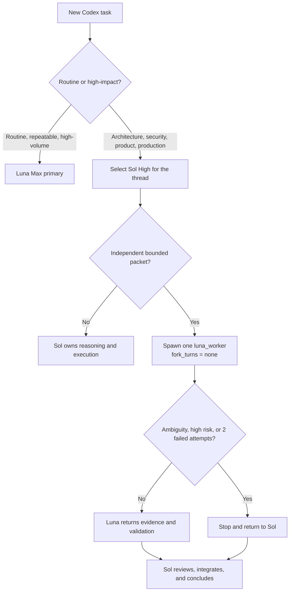

# Codex Sol–Luna Orchestration

A tested, production-minded Codex workflow that uses **Luna Max for everyday
and token-heavy work**, while explicitly using **Sol High for architecture,
high-impact decisions, authorization, and final acceptance**.

Sol can delegate independent, bounded execution packets to one global custom
agent: `luna_worker`, pinned to Luna Max.

> [!IMPORTANT]
> This is a community workflow, not an official OpenAI project. Model names,
> reasoning levels, configuration keys, and multi-agent compatibility can
> change. The repository separates official documentation, locally observed
> runtime behavior, and an optional unofficial compatibility workaround.

## The operating model

The default setup is intentionally simple:

| Situation | Primary model | What happens |
|---|---|---|
| Routine task, web research, repository exploration, browser work, repetitive or high-volume operations | **Luna Max** | Luna handles the task directly. |
| Architecture, product/security/production decisions, cross-system changes, heavy coding, final acceptance | **Sol High** | Start or switch that thread explicitly to Sol High. |
| Independent bounded work inside a Sol thread | **Luna Max subagent** | Sol creates one self-contained `luna_worker` packet with `fork_turns="none"`. |
| Material ambiguity, high-risk boundary, or two evidence-based failures | **Return to Sol** | Luna stops and returns evidence, remaining hypotheses, and the exact blocker. |



## Why this topology

The goal is not to send every small task to a subagent. The goal is to place
expensive reasoning where it has the highest value and route large amounts of
clear, verifiable work to Luna.

The routing decision is based on:

- reasoning difficulty, not task size;
- ambiguity and number of plausible interpretations;
- blast radius and reversibility;
- security, authorization, data-integrity, and production risk;
- whether the result can be checked objectively;
- whether file ownership can remain disjoint;
- whether two evidence-based attempts have already failed.

A mechanical change across one hundred files can be a good Luna task. A
ten-line authorization change may belong to Sol.

## Fastest installation: give this repository to Codex

Open a fresh Codex task and paste the following prompt:

```text
Install the workflow documented at:
https://github.com/augiefra/codex-sol-luna-orchestration

Read README.md and docs/INSTALL-WITH-CODEX.md completely before changing
anything. Audit my current Codex configuration first. Preserve every unrelated
setting and never replace my complete config.toml or AGENTS.md.

Use Luna Max as the global default. Install the single global custom agent
luna_worker in Luna Max. Merge the routing and runtime-identification rules
into my existing global AGENTS.md. Keep architecture and high-impact threads
explicitly selectable as Sol High.

Try native multi-agent support first. Do not apply the model-catalog workaround
unless Luna is actually filtered out by the current runtime; if it is needed,
show me the evidence and ask for approval before applying the documented
workaround.

Before finishing:
1. show the exact diff;
2. parse and validate every changed TOML file;
3. run the static verifier;
4. start a clean Sol High smoke-test thread;
5. spawn exactly one luna_worker with fork_turns="none";
6. prove the parent is Sol High and the child is Luna Max from each process's
   exact runtime rollout, using CODEX_THREAD_ID and session_meta.payload.id;
7. report any step that still requires a full Codex restart.

Do not publish, commit, push, deploy, or change external systems as part of the
installation.
```

The full guarded installation contract is in
[`docs/INSTALL-WITH-CODEX.md`](docs/INSTALL-WITH-CODEX.md).

## What gets installed

The minimal installation consists of three merged components:

1. Selected keys from [`templates/config.fragment.toml`](templates/config.fragment.toml)
   merged into `~/.codex/config.toml`.
2. [`templates/luna_worker.toml`](templates/luna_worker.toml) copied to
   `~/.codex/agents/luna_worker.toml`.
3. [`templates/AGENTS-routing.md`](templates/AGENTS-routing.md) merged into the
   user's existing global `~/.codex/AGENTS.md`.

The installer must not copy a whole personal Codex configuration. Approval,
sandbox, network, authentication, MCP, plugin, project-trust, and connector
settings belong to the local user and stay untouched.

## The one custom agent

This workflow deliberately uses a single custom agent:

```text
luna_worker
```

The user should never need to remember multiple explorer/browser/operator
profiles. Sol receives the natural-language objective and decides whether a
bounded delegation is useful.

Every delegated packet contains:

- objective and observable outcome;
- in-scope and out-of-scope boundaries;
- authorized actions;
- invariants to preserve;
- expected result and exact validation;
- writable files, with one owner per file;
- conditions that require an immediate return to the parent.

Custom agents are launched with `fork_turns="none"` and a self-contained
packet. This avoids trying to combine a custom agent profile with a full
history fork and prevents old architecture threads from paying to duplicate
their entire context.

## Runtime truth, not configuration claims

A TOML file saying `gpt-5.6-luna` does not prove that a rollout actually used
Luna. This workflow verifies the model from the runtime:

1. read the process's own `CODEX_THREAD_ID`;
2. locate rollout candidates without selecting by recency;
3. require exact structural equality:
   `session_meta.payload.id == CODEX_THREAD_ID`;
4. read the latest `turn_context` in that validated rollout;
5. report the actual `model` and reasoning `effort`.

See [`docs/VERIFICATION.md`](docs/VERIFICATION.md) and the read-only helper
[`scripts/inspect_runtime_model.py`](scripts/inspect_runtime_model.py).

## Native support first

Always test the current Codex version without a custom model catalog first.
If Luna is natively accepted by the active multi-agent runtime, do not install
an override.

Some Codex Desktop builds have been observed exposing Sol and Terra as
multi-agent V2 models while a locally cached Luna entry still says V1. The
optional catalog workaround documented here changes that one local field in a
fresh copy of the user's own cache. It is **not an official OpenAI procedure**,
it replaces the full active catalog rather than overlaying it, and it can
become stale after a Codex update.

Read [`docs/MODEL-CATALOG-WORKAROUND.md`](docs/MODEL-CATALOG-WORKAROUND.md)
before considering it.

## Repository map

```text
.
├── README.md
├── AGENTS.md
├── SECURITY.md
├── docs/
│   ├── ARCHITECTURE.md
│   ├── INSTALL-WITH-CODEX.md
│   ├── MANUAL-INSTALL.md
│   ├── MODEL-CATALOG-WORKAROUND.md
│   ├── OFFICIAL-SOURCES.md
│   ├── TROUBLESHOOTING.md
│   └── VERIFICATION.md
├── scripts/
│   ├── build_luna_v2_catalog.py
│   ├── inspect_runtime_model.py
│   └── verify_install.py
└── templates/
    ├── AGENTS-routing.md
    ├── config.fragment.toml
    └── luna_worker.toml
```

## Tested behavior

The workflow was smoke-tested on Codex Desktop for macOS on 2026-08-03:

- a clean thread ran as `gpt-5.6-sol` with effort `high`;
- it spawned one real custom `luna_worker`;
- the child ran as `gpt-5.6-luna` with effort `max`;
- the same topology worked in an existing architecture thread;
- `fork_turns="none"` prevented full-history/custom-agent incompatibility;
- parent and child independently identified their actual runtime from their
  own `CODEX_THREAD_ID` and exact rollout metadata.

This is evidence for that tested environment, not a permanent compatibility
promise for every Codex build or account.

Official OpenAI documentation and the boundary between documented features,
community policy, and local observations are listed in
[`docs/OFFICIAL-SOURCES.md`](docs/OFFICIAL-SOURCES.md).

## Related work

The routing gates and the useful distinction between task size and reasoning
difficulty were informed in part by
[`BruceLanLan/sol-luna-engineering-workflow`](https://github.com/BruceLanLan/sol-luna-engineering-workflow).
That project uses a different center of gravity—Luna as the primary orchestrator
and Sol as an advisor—while this repository keeps Sol as the owner of
architecture-thread decisions and final acceptance.

## License

[MIT](LICENSE)
