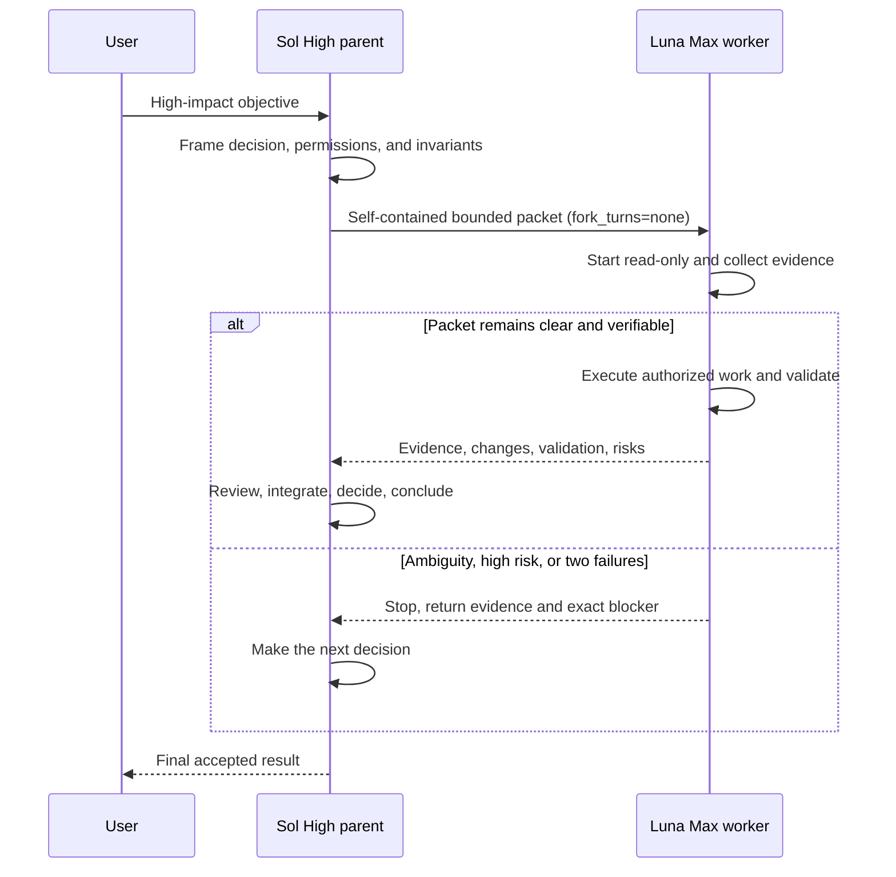

# Architecture and routing policy

## Objective

Use the least expensive model that can safely and verifiably complete the work,
without moving architecture ownership, authorization, or final acceptance away
from the model selected to lead the thread.

The workflow has two normal thread modes:

1. **Luna Max primary** for routine, repeatable, high-volume work.
2. **Sol High primary** for architecture and high-impact work. Sol may delegate
   bounded execution packets to one custom Luna Max worker.

Terra is intentionally absent from automatic routing. It remains available
when the user asks for it or a verified constraint requires it.

## Responsibilities

### Luna Max as a primary model

Use Luna directly for:

- routine browser or console work;
- repository and documentation exploration;
- web research and evidence collection;
- transformations with deterministic acceptance criteria;
- repetitive or token-heavy work;
- local tasks with low blast radius and clear rollback.

When Luna is the explicitly selected primary model, it owns that thread. The
workflow does not silently replace it with Sol.

### Sol High as an architecture-thread owner

Explicitly select Sol High for:

- architecture and cross-system contracts;
- product, security, privacy, authorization, or production judgment;
- ambiguous incidents with several plausible root causes;
- destructive migrations or data-integrity risk;
- payment, authentication, or compatibility decisions;
- heavy coding where reasoning quality dominates token volume;
- authorization of external mutations;
- evidence review, integration, and final acceptance.

### `luna_worker`

`luna_worker` is an execution role, not a second architect. It can receive an
independent packet for exploration, testing, mechanical implementation, or
bounded operations. It cannot change the global objective or make a new
architecture, product, security, or production decision.

## Delegation decision

Do not route by file count or line count. Evaluate:

| Dimension | Luna-friendly | Sol-friendly |
|---|---|---|
| Ambiguity | One clear interpretation | Material contradiction or unresolved choice |
| Blast radius | Local and reversible | Cross-system, public, destructive, or difficult to roll back |
| Validation | Deterministic and available | Subjective, missing, or expensive to reproduce |
| Security/data | No sensitive boundary | Auth, permissions, secrets, payments, integrity |
| Failure state | No failed evidence-based attempt | Two distinct evidence-based attempts have failed |
| Ownership | One explicit owner per file | Shared or conflicting file ownership |

## Task packet contract

Every delegation must be self-contained because custom agents use
`fork_turns="none"`.

```text
Objective:
  Observable outcome, not a vague activity.

Relevant context:
  Only the facts and source-of-truth references needed by the worker.

In scope:
  Explicit systems, directories, files, commands, and questions.

Out of scope:
  Decisions and mutations the worker must not make.

Authorized actions:
  Read-only by default; list every permitted mutation.

Invariants:
  Existing behavior, user changes, security boundaries, and contracts to keep.

Writable ownership:
  Exact files the worker owns; no file can have two owners in one batch.

Expected result:
  Evidence, diff, report, test result, or other concrete artifact.

Validation:
  Exact commands, comparisons, or acceptance criteria.

Return conditions:
  Ambiguity, high-risk boundary, unavailable validation, or two failed attempts.
```

## Parent/child lifecycle



## Why one custom agent

Four or five named worker profiles force the user and the orchestrator to
remember a taxonomy that adds little value. One worker with a precise packet is
easier to maintain, easier to verify, and less likely to produce role confusion.

`max_concurrent_threads_per_session = 10` is a capacity ceiling, not a target.
The normal case is zero or one subagent. Multiple Luna workers are justified
only for genuinely independent packets with disjoint writable files and
separate validation.

## Runtime identity

Configuration is intent, not execution proof. The effective identity is read
from the exact rollout belonging to the current process:

```text
CODEX_THREAD_ID
  -> exact session_meta.payload.id match
  -> latest turn_context
  -> model + effort
```

This prevents a parent rollout that mentions a child UUID—or a child rollout
that mentions its parent—from being mistaken for the current process.
